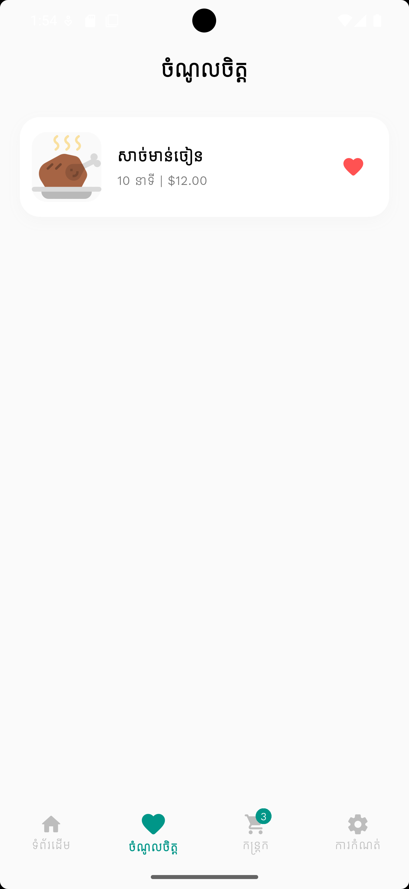
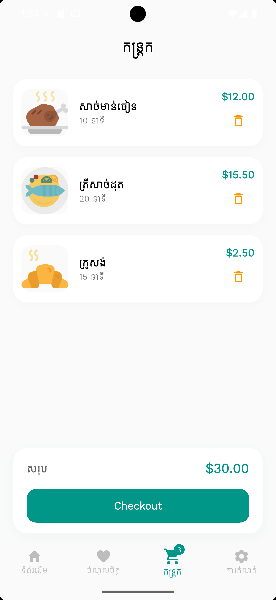
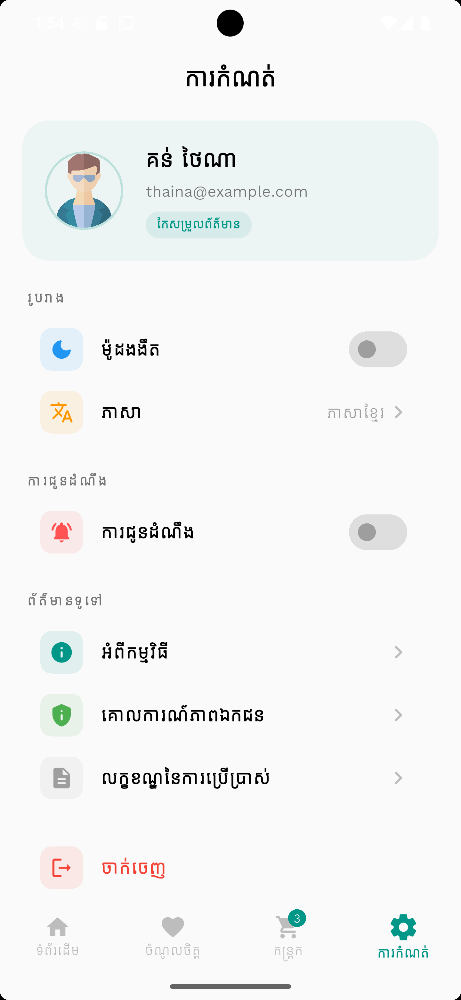
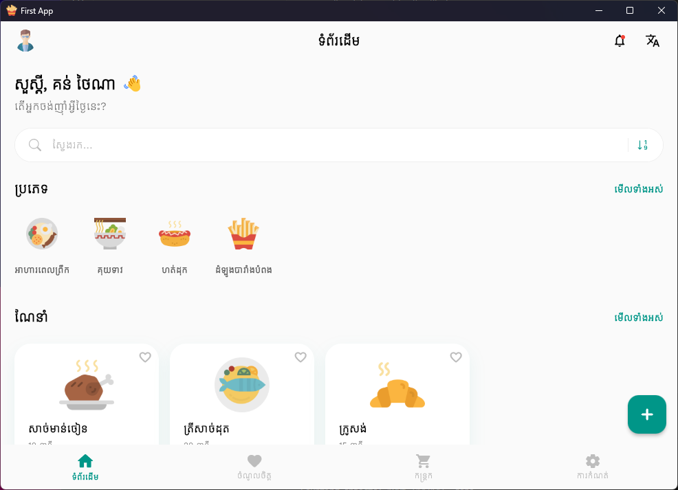

# Flutter Food App

A modern, high-performance Food Delivery Application built with Flutter. This app features a clean Material 3 UI, multi-language support (English and Khmer), and dark mode compatibility.

## Features

- **Material 3 UI**: Clean and premium design.
- **Dark Mode**: Fully supports native dark mode with adaptive styling.
- **Multilingual**: Easily switch between English and Khmer.
- **Cart Management**: Add diets to cart, track totals, and manage favorites.
- **Responsive Layout**: Optimized for various screen sizes.

## Screenshots
### Mobile
<p align="center">
  
  
  
  
</p>

### Window
<p align="center">
  
</p>

## Getting Started

### Prerequisites

- Flutter SDK
- Dart SDK
- Android Studio / VS Code

### Installation

1. Clone the repository:
   ```bash
   git clone https://github.com/your-username/flutter-food-app.git
   ```
2. Navigate to the project directory:
   ```bash
   cd flutter-food-app
   ```
3. Install dependencies:
   ```bash
   flutter pub get
   ```
4. Run the application:
   ```bash
   flutter run
   ```

## Folder Structure

- `lib/models`: Data models and mock services.
- `lib/pages`: Application screens (Home, Cart, Favorites, Settings).
- `lib/providers`: State management using ChangeNotifier.
- `assets/icons`: SVG icons used throughout the app.
- `assets/screenshots`: UI previews.
